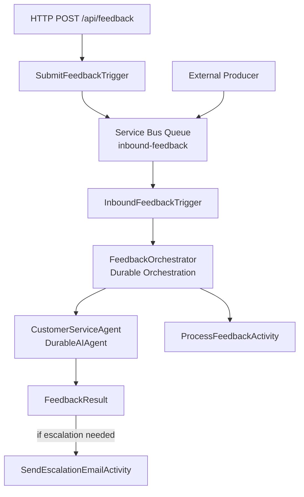

# 🍦Durable Agent Demo 🍨

> ⚠️ **WARNING: This is a sample/demo project intended for learning and experimentation. It is NOT production-ready and should not be deployed to production environments without thorough review and hardening.**

A serverless, event-driven application demonstrating **[Durable Agents](https://learn.microsoft.com/en-us/agent-framework/integrations/azure-functions?pivots=programming-language-csharp)** — the integration of the **Microsoft Agent Framework** with **Azure Durable Functions** to create stateful AI agents that persist conversation state, survive failures, and orchestrate multi-agent workflows with reliable execution guarantees.

The project uses **Azure Functions (Flex Consumption)** with the **Durable Task Scheduler** to host an Azure OpenAI-backed AI agent that analyzes customer feedback, assesses sentiment and risk, and recommends actions — all through a durable orchestration that automatically checkpoints state. Customer feedback arrives via **Azure Service Bus** or an **HTTP endpoint**, is processed by a `CustomerServiceAgent` with tool-calling capabilities, and flows through an extensible activity pipeline — secured entirely with managed identity (zero secrets).

The demo scenario is **Froyo Foundry**, a fictional frozen yogurt chain that processes customer feedback with AI.

## Architecture



All inter-service communication uses **system-assigned managed identity** with RBAC — no connection strings, SAS tokens, or shared keys.

### Azure Resources

| Resource | SKU / Tier | Purpose |
|---|---|---|
| Azure Functions | Flex Consumption (FC1) | Serverless compute with per-execution billing |
| Durable Task Scheduler | Consumption | Managed backend for durable orchestrations |
| Azure AI Foundry | Cognitive Services | Azure OpenAI endpoint for AI agent |
| Azure Service Bus | Standard | Reliable async messaging (queues/topics) |
| Azure Storage Account | Standard LRS | Function runtime deployment artifacts |
| Application Insights | Workspace-based | Monitoring, diagnostics, and telemetry |
| Log Analytics Workspace | PerGB2018 | Backing store for Application Insights |

## Project Structure

```
infra/bicep/                            # Azure Bicep infrastructure-as-code
  main.bicep                            # Subscription-scoped deployment (4 phases)
  main.bicepparam                       # Parameters (baseName, region, tags)
  deploy.sh                             # CLI wrapper: deploy / what-if / delete
  modules/
    ai-foundry.bicep                    # Azure AI Foundry (Cognitive Services)
    durable-task.bicep                  # Durable Task Scheduler + TaskHub
    rbac.bicep                          # RBAC role assignments

source/
  DurableAgent.slnx                     # .NET 10 XML solution file
  Directory.Build.props                 # Shared build properties
  global.json                           # SDK version pin (10.0.102)
  DurableAgent.Core/                    # Domain logic (zero cloud SDK deps)
    Models/
      ContactMethod.cs                  # Enum: Email, Phone
      CustomerInfo.cs                   # Sealed record: customer details
      FeedbackMessage.cs                # Sealed record: inbound feedback DTO
      FeedbackResult.cs                 # Sealed record: AI analysis result (with nested types)
      Flavor.cs                         # Sealed record: frozen yogurt flavor
      Store.cs                          # Sealed record: store details
  DurableAgent.Functions/               # Azure Functions isolated worker
    Program.cs                          # App entry point, AI agent + DI config
    host.json                           # Durable Task + Service Bus config
    Triggers/
      InboundFeedbackTrigger.cs         # Service Bus trigger → starts orchestration
      SubmitFeedbackTrigger.cs          # HTTP POST /api/feedback → enqueues to Service Bus
    Orchestrations/
      FeedbackOrchestrator.cs           # Durable orchestrator with AI agent
    Activities/
      ProcessFeedbackActivity.cs        # Processes feedback after AI analysis
      SendEscalationEmailActivity.cs    # Sends escalation for human-review cases
    Services/
      IFeedbackQueueSender.cs           # Queue sender abstraction
      ServiceBusFeedbackQueueSender.cs  # Service Bus implementation
    Models/
      FeedbackSubmissionRequest.cs      # HTTP request DTO with validation
      SendEscalationEmailInput.cs       # Escalation activity input
    Tools/                              # AI agent tool functions
      GenerateCouponCodeTool.cs         # Generates coupon codes
      GetCurrentUtcDateTimeTool.cs      # Returns current UTC timestamp
      GetStoreDetailsTool.cs            # Looks up store info by ID
      ListFlavorsTool.cs                # Lists available flavors
      OpenCustomerServiceCaseTool.cs    # Opens a customer service case
      RedactPiiTool.cs                  # Redacts PII from text
  DurableAgent.Core.Tests/              # xUnit tests for Core
  DurableAgent.Functions.Tests/         # xUnit + FakeItEasy tests for Functions

docs/
  plan-durableAgentServerless.md        # Application implementation plan
  bicep-planning-files/                 # Infrastructure plans
```

## Prerequisites

- [.NET 10 SDK](https://dotnet.microsoft.com/download/dotnet/10.0) (pinned via `global.json`)
- [Azure CLI](https://learn.microsoft.com/cli/azure/install-azure-cli) with Bicep
- [Azure Functions Core Tools](https://learn.microsoft.com/azure/azure-functions/functions-run-tools) v4+
- An Azure subscription

> **Tip:** This repo includes a dev container with all tooling pre-installed.

## Getting Started

### Build & Test

```bash
cd source
dotnet build DurableAgent.slnx
dotnet test DurableAgent.slnx
```

### Deploy Infrastructure

```bash
# Login to Azure
az login

# Preview changes (what-if)
./infra/bicep/deploy.sh -w

# Deploy
./infra/bicep/deploy.sh

# Override region
./infra/bicep/deploy.sh -l westus2

# Delete resources
./infra/bicep/deploy.sh -d
```

### Validate Bicep

```bash
az bicep build --file infra/bicep/main.bicep --stdout
```

## Data Flow

### Service Bus Path

1. An external producer sends a JSON `FeedbackMessage` to the `inbound-feedback` Service Bus queue.
2. **`InboundFeedbackTrigger`** receives the message, deserializes it to a `FeedbackMessage`, and schedules a new orchestration instance.
3. **`FeedbackOrchestrator`** (a durable orchestration) runs the workflow:
   - Uses `context.GetAgent("CustomerServiceAgent")` to obtain a `DurableAIAgent` — the durable wrapper that checkpoints agent calls within the orchestration.
   - Creates an `AgentSession` and calls `RunAsync<FeedbackResult>()` to analyze the feedback. The AI agent assesses sentiment, evaluates risk, recommends an action, and returns a structured `FeedbackResult` using tool-calling and JSON structured output.
   - If the result indicates human follow-up is required (`FollowUp.RequiresHuman`), calls **`SendEscalationEmailActivity`** to escalate.
   - Calls **`ProcessFeedbackActivity`** to finalize processing.
   - All agent state and conversation history is automatically persisted by the Durable Task Scheduler, surviving failures and restarts.

### HTTP Path

1. A client sends a `POST` request to `/api/feedback` with a `FeedbackSubmissionRequest` JSON body.
2. **`SubmitFeedbackTrigger`** validates the request, maps it to a `FeedbackMessage`, and enqueues it to Service Bus via `IFeedbackQueueSender`.
3. From there, processing follows the Service Bus path above.

### AI Agent Tools

The CustomerServiceAgent has access to 6 tool functions: `GetCurrentUtcDateTime`, `GenerateCouponCode`, `GetStoreDetails`, `ListFlavors`, `OpenCustomerServiceCase`, and `RedactPii`. These allow the AI to look up store info, generate coupons for unhappy customers, open support cases, and more.

### Sample Message

```json
{
  "storeId": "store-001",
  "orderId": "ord-100",
  "customer": {
    "preferredName": "Milo",
    "firstName": "Milo",
    "lastName": "Mustang",
    "email": "milo@example.com",
    "phoneNumber": "555-0100",
    "preferredContactMethod": "Email"
  },
  "channel": "web",
  "rating": 4,
  "comment": "Great froyo! The Recursive Raspberry was fantastic and the staff was friendly. Will definitely come back!"
}
```

## Key Design Decisions

- **[Durable Agents](https://learn.microsoft.com/en-us/agent-framework/integrations/azure-functions?pivots=programming-language-csharp)** — Microsoft Agent Framework + Azure Durable Functions for stateful AI agents with automatic state persistence, failure recovery, and deterministic orchestrations
- **DurableAIAgent orchestration** — The orchestrator uses `context.GetAgent()` to get a `DurableAIAgent` wrapper that checkpoints agent calls within the durable orchestration framework
- **Structured AI output** — Azure OpenAI with `ChatResponseFormat.ForJsonSchema` produces typed `FeedbackResult` responses including sentiment, risk assessment, recommended actions, and optional coupons
- **AI tool calling** — The agent has 6 tool functions (store lookup, coupon generation, case management, PII redaction, etc.) that it invokes autonomously during analysis
- **Zero secrets** — All authentication uses system-assigned managed identity + RBAC
- **Flex Consumption (FC1)** — Serverless scaling with per-execution billing; scales to zero when idle
- **Durable Task Scheduler (Consumption)** — Fully managed orchestration backend that persists agent state and conversation history
- **Function-based pattern** — Static classes with `[OrchestrationTrigger]` / `[ActivityTrigger]` (not class-based `TaskOrchestrator<>`)
- **Azure Verified Modules (AVM)** — Bicep uses AVM for standard resources; raw Bicep only where no AVM exists
- **Subscription-scoped deployment** — Bicep creates the resource group, then deploys resources into it across 4 phases

## Technology Stack

| Layer | Technology |
|---|---|
| Runtime | .NET 10 / C# 14, isolated worker model |
| AI Agents | [Durable Agents](https://learn.microsoft.com/en-us/agent-framework/integrations/azure-functions?pivots=programming-language-csharp) (Microsoft Agent Framework + Azure Durable Functions) |
| AI Model | Azure OpenAI (via `Azure.AI.OpenAI`) |
| Orchestration | Azure Durable Functions + Durable Task Scheduler |
| Messaging | Azure Service Bus (Standard) |
| Infrastructure | Azure Bicep with Azure Verified Modules |
| Testing | xUnit 2.9.3, FakeItEasy 9.0.1 |
| CI/CD | GitHub Actions (planned) |

## Learn More

- [Durable Agents — Azure Functions (Durable)](https://learn.microsoft.com/en-us/agent-framework/integrations/azure-functions?pivots=programming-language-csharp) — Official Microsoft Agent Framework documentation for building stateful AI agents with Azure Durable Functions
- [Microsoft Agent Framework Overview](https://learn.microsoft.com/en-us/agent-framework/overview/agent-framework-overview)
- [Durable Task Scheduler](https://learn.microsoft.com/en-us/azure/azure-functions/durable/durable-task-scheduler/durable-task-scheduler) — Managed backend for durable orchestrations and agent state
- [Azure Functions Flex Consumption Plan](https://learn.microsoft.com/en-us/azure/azure-functions/flex-consumption-plan)

## Contributing

This is a demo/sample project. Feel free to fork and experiment.

## License

This project is provided as-is for demonstration purposes.
